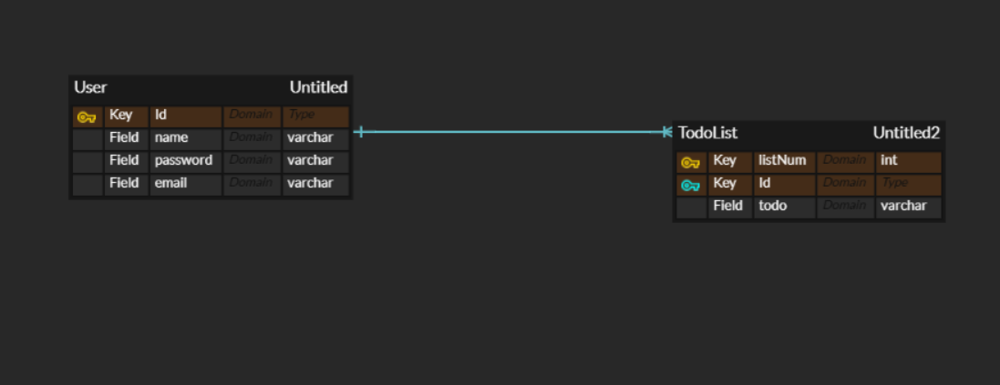

# 일정 관리 어플
## API 목록

|Method | path                | RequestParam | Request                           | Response           | Description | StatusCode |
|-------|---------------------|--------------|-----------------------------------|--------------------|-------------|------------|
  |GET| /api/lists          | -| -                                 | [{"todo":"할일 목록"}] | 일정  목록 조회   | 200|
   |POST | /api/lists/{listId} |-| {"listNum": "1", "todo": "영어 공부"} | -                  | 일정 생성       | 200|
    |GET | /api/lists/{listId} | - | -| [{"listNum": 1, "todo": "영어 공부"}] |  일정 단건 조회 | 200|

## ERD

    